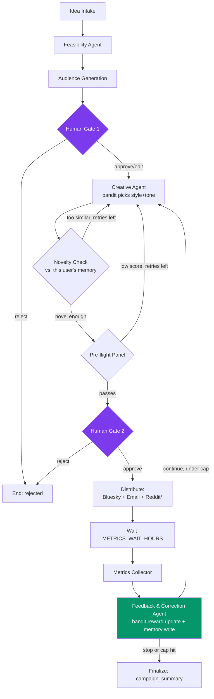

# Architecture

## Flow

\* Reddit is currently on hold (API access blocked by policy changes) — the code stays intact behind `ENABLE_REDDIT`.

State lives in Supabase Postgres, checkpointed per-campaign via LangGraph's `PostgresSaver` so the graph can pause at a gate or the metrics-wait window and resume from a completely separate process later — this is what lets ephemeral GitHub Actions runs drive the loop: each `campaign-loop.yml` run loads the checkpoint, checks whether the campaign is actually ready to advance, and no-ops otherwise.

## Why this isn't just an LLM wrapper

1. **Real closed-loop optimization, not "regenerate and hope."** A LinUCB contextual bandit picks each round's creative archetype (5 image styles × 4 copy tones) using real engagement as reward and persona/channel/domain features as context — shared platform-wide, so one user's outcome in a domain improves selection for other users in that same domain, without blindly transferring across unrelated domains.
2. **Explainable feasibility scoring.** A transparent weighted composite of real signals (Google Trends, NewsAPI, Bluesky/Mastodon community search) plus an LLM-written rationale grounded in this user's own similar past campaigns — never a black-box number.
3. **Real distribution + real metrics.** Actual posts to Bluesky and actual emails via Resend, with engagement pulled back from those platforms' own APIs.
4. **Human-in-the-loop as a first-class graph node**, not bolted on — two approval gates wired directly into the state machine via Supabase, resumed from a checkpoint once a decision row appears.
5. **Actually deployed automation.** A scheduled GitHub Actions workflow drives iteration autonomously, with an Edge Function providing immediate (non-cron) resumption on gate decisions and stop requests.
6. **Per-user retrieval memory (pgvector).** Every round's idea/persona/creative + its outcome reward is embedded and stored per-user, retrieved for feasibility grounding and for a novelty check that keeps creative from converging on near-duplicates.
7. **Engineering rigor around AI quality.** An LLM-as-judge eval harness against a hand-labeled golden set runs in CI on every push.
8. **A genuine 3-tier product model** (free / subscribed / bring-your-own-key) with real multi-tenancy — Postgres row-level security, not just application-level filtering.
9. **A real frontend**, not an internal tool — a Vite/React SPA with live Supabase Realtime updates and a dedicated Metrics view (per-round/per-channel engagement, which arm was used, reward trend).

## Known, documented simplifications

- **Shared distribution accounts.** All users' campaigns currently post through one platform-owned Bluesky account, Reddit account, and Resend sender identity, not per-user connected accounts — a deliberately staged decision (per-user OAuth across three platforms is real plumbing with little AI/ML signal), not an oversight.
- **Stubbed billing.** The `subscriptions` table is a manually-toggled flag, not a real Stripe integration — the point is demonstrating the 3-tier product model, not payment infra.
- **Bandit updates aren't transactionally locked.** Each arm's ridge-regression stats are read-modify-write against a shared Postgres row with no row locking — an acceptable simplification at portfolio scale/traffic, not solved with distributed locking.
